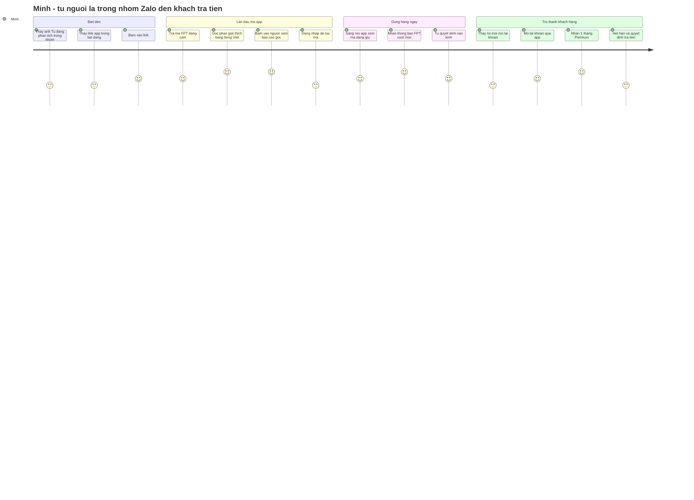
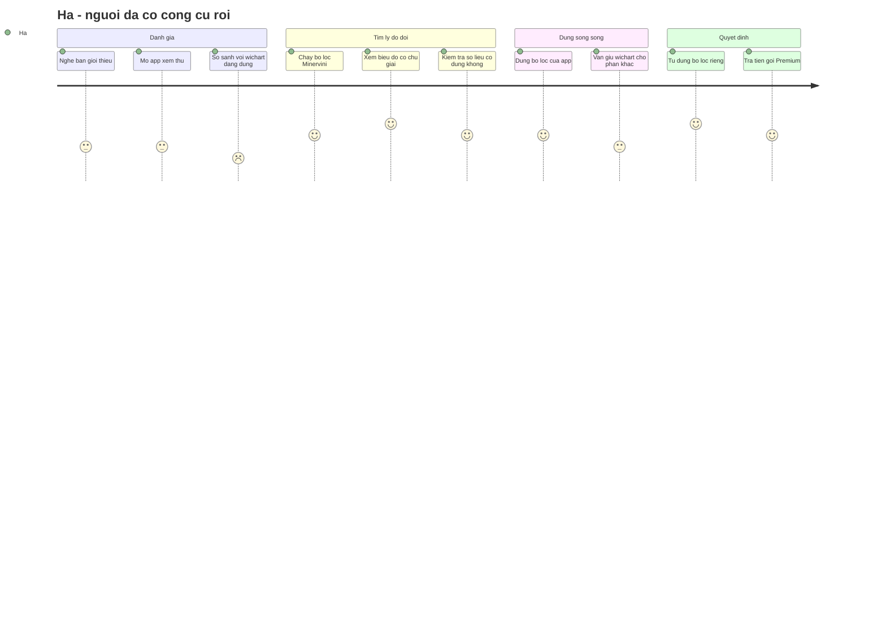
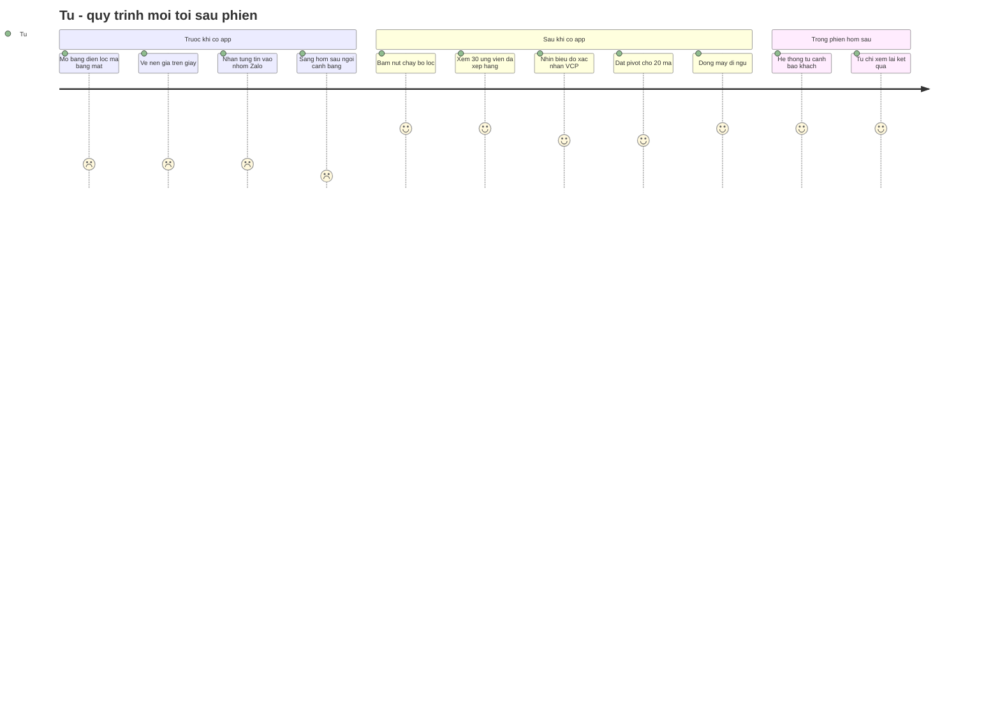
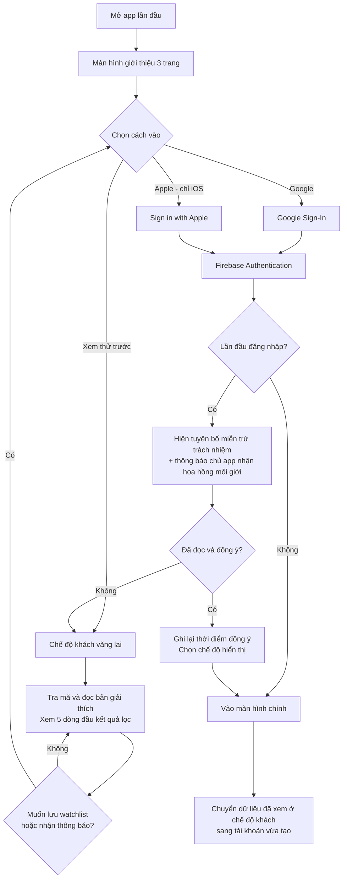
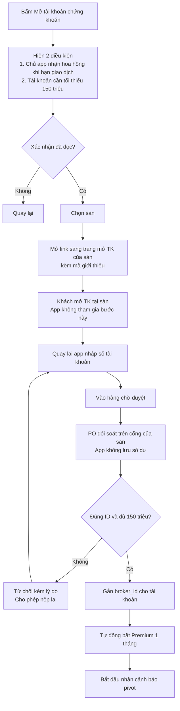
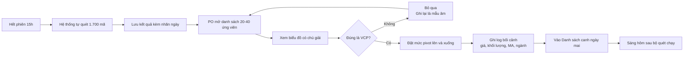
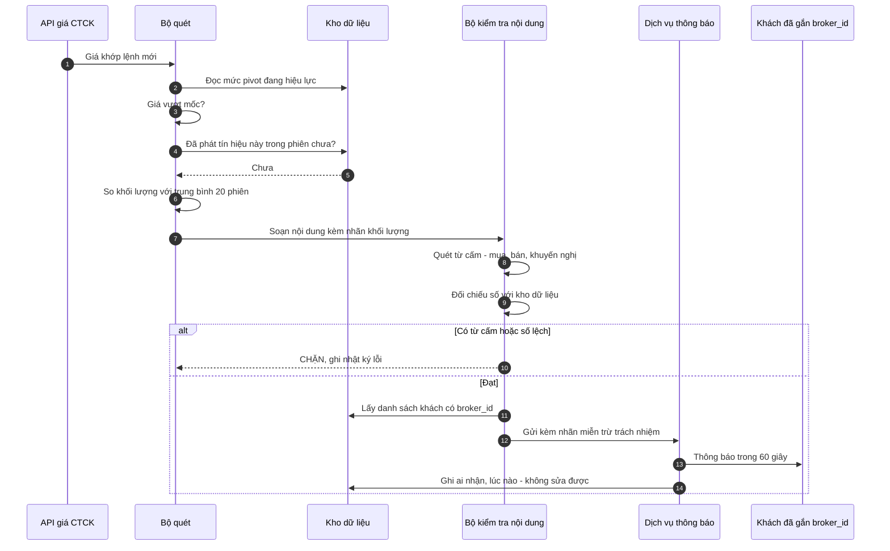
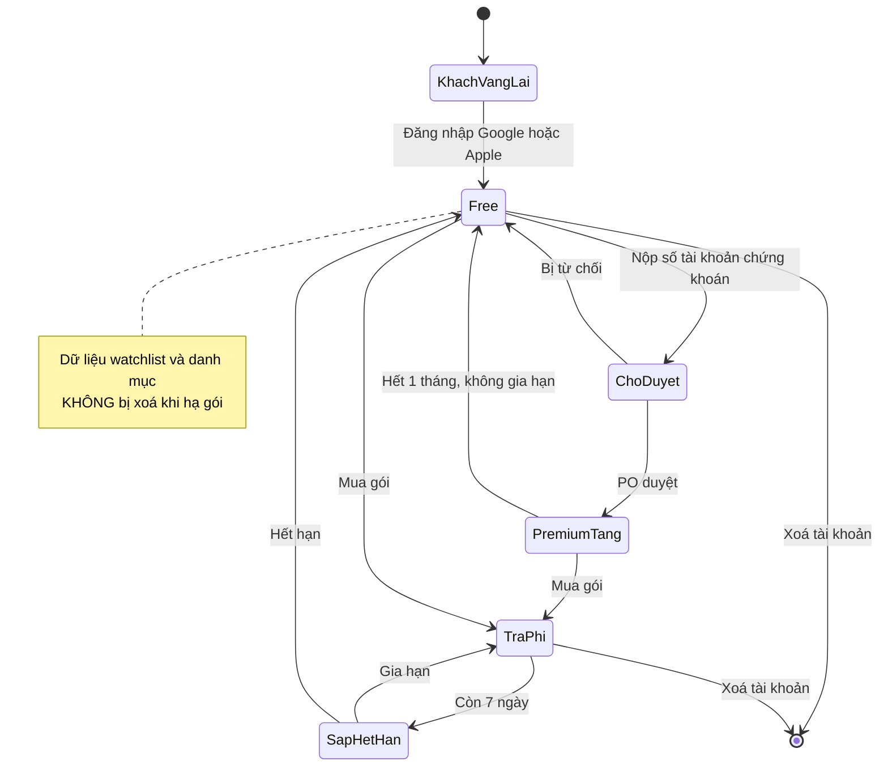
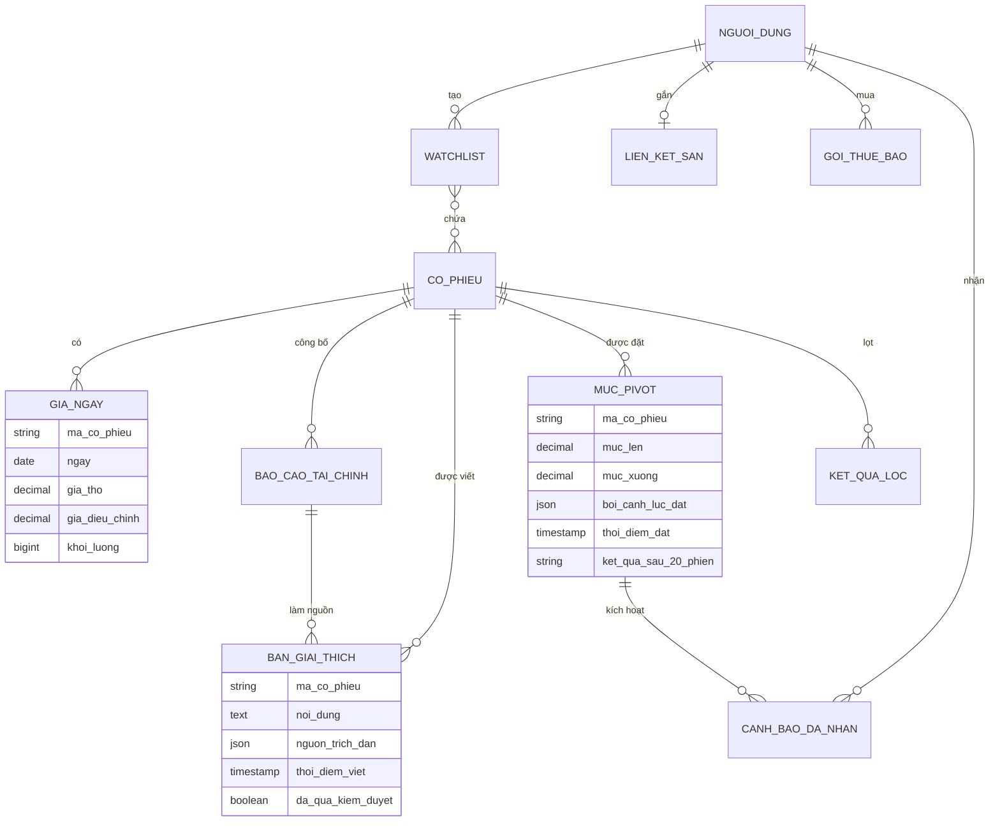

# 04 — USER JOURNEYS · FLOWS · DIAGRAMS

| | |
|---|---|
| **Bài tập** | KTS Vibe Engineer — Week 2, Day 3 |
| **Product Owner** | Tú |
| **Scrum Master / BA** | Claude |
| **Đầu vào** | `01-USER-STORIES.md` · `02-MOSCOW.md` · `03-PRODUCT-BACKLOG.md` |
| **Ngày lập** | 29/07/2026 |
| **Công cụ sơ đồ** | Mermaid |

---

## 0. Đối chiếu với đề bài của thầy

| # | Thầy giao | Trạng thái |
|---|---|---|
| 1 | Review URS change · User Stories | ✅ Xong ở `01` — 21 story, đã rà INVEST |
| 2 | Auth: Firebase · **Google Sign-In** · Apple · Guest Mode · Survey 700 | ⚠️ Phần A — cần chỉnh `AUTH-D1` |
| 3 | Monetization → PO-Product | ✅ Xong ở `02` §5, `PRICE-D1` |
| 4 | Payments: MoMo · SePay · Google Pay | ⚠️ Phần A — cần xem lại `PAY-D1` |
| 5 | **User Journeys → Flow → Diagram (Mermaid/UML)** | 🆕 Phần B, C, D, E |

---

# PHẦN A — Ba quyết định cần xem lại theo gợi ý của thầy

## A1. 🔴 Apple bắt buộc có "Sign in with Apple"

Mình đã chốt `AUTH-D1` chỉ dùng Google. Nhưng **quy định App Store 4.8**: ứng dụng nào cho đăng nhập bằng dịch vụ bên thứ ba (Google, Facebook…) thì **bắt buộc phải có thêm Sign in with Apple** trên iOS — trừ khi có phương án thay thế đạt chuẩn riêng tư tương đương.

Không có thì **bị từ chối khi duyệt**. Đây là lý do thầy viết cả "Apple" bên dưới Google.

| Phương án | Chi phí | Ghi chú |
|---|---|---|
| **(a)** Thêm Sign in with Apple | +3 điểm | Firebase Authentication hỗ trợ sẵn, cấu hình là chính. **Khuyến nghị** |
| (b) Chỉ phát hành Android trước | 0 | Mất tệp iPhone — mà khách có 150tr trong tài khoản thì tỷ lệ dùng iPhone cao |

**→ `AUTH-D2`: thêm Sign in with Apple? SM khuyến nghị (a).**

## A2. 🟡 Guest Mode — thầy gợi ý, và nó giải quyết một điểm đau thật

Hiện `US-06a` bắt đăng nhập ngay từ màn hình đầu. Vẽ hành trình của Minh ra (Phần B) thì thấy rõ: **bắt đăng nhập trước khi cho xem gì là chỗ rơi rụng lớn nhất.**

Đề xuất: **cho xem không cần đăng nhập, chỉ chặn ở chỗ cần lưu dữ liệu.**

| Việc | Khách vãng lai | Đã đăng nhập |
|---|---|---|
| Tra mã, đọc bản giải thích | ✅ **Được** | ✅ |
| Xem kết quả bộ lọc | ✅ Xem được 5 dòng đầu | ✅ Đầy đủ |
| Lưu watchlist, đặt cảnh báo | ❌ → mời đăng nhập | ✅ |
| Nhận thông báo | ❌ | ✅ |

Chi phí: **+3 điểm**. Đổi lại là hạ rào cản ở đúng chỗ 700 người bấm vào link lần đầu.

**→ `AUTH-D3`: có Guest Mode? SM khuyến nghị có.**

## A3. ❌ Khảo sát 700 người — PO quyết định không làm

Thầy gợi ý `700 → Survey`. **PO chốt 29/07: không khảo sát, quyết theo phán đoán nghề nghiệp.**

Ghi nhận đánh đổi để sau này nhìn lại biết vì sao:

| | |
|---|---|
| **Được** | Nhanh, không mất 1–2 tuần chờ phản hồi. PO là môi giới 5+ năm, hiểu tệp khách hơn bất kỳ bảng hỏi nào |
| **Mất** | Không có số liệu để đối chiếu khi sau này phải giải thích *"vì sao lúc đó chọn thế"*. Nếu tới tuần 21 phát hiện khách cần thứ khác thì không có gì để truy ngược |
| **Giảm thiểu** | Mốc dùng thử vẫn là nơi lấy phản hồi thật — chỉ là muộn hơn khảo sát khoảng 3–4 tháng |

## A4. 🟡 Thanh toán — thầy mở lại MoMo và Google Pay

| Kênh | Ưu | Nhược |
|---|---|---|
| **SePay** *(đang chọn)* | Phí gần 0, chỉ cần tài khoản ngân hàng | Không trừ tiền tự động. **Đặt QR trong app iOS là vi phạm quy định Apple** |
| **MoMo** | Người Việt quen, có thanh toán định kỳ | Phí ~2%, cần pháp nhân |
| **Google Pay / In-App Purchase** | Đúng luật cửa hàng, tự động gia hạn | **Apple và Google ăn 15–30%** |

Hiện `MSC-D2` đã hoãn xây thanh toán sang sau Bản 1 nên **chưa phải chốt gấp**. Nhưng khi chốt thì phải giải cùng lúc bài toán *"bán trong app iOS thế nào cho không bị từ chối"* — xem `PAY-R1`.

---

# PHẦN B — USER JOURNEYS

## B1. Hành trình của Minh — nhà đầu tư F0

### Chi tiết từng giai đoạn

| Giai đoạn | Minh làm gì | Minh nghĩ gì | 😊 | Điểm đau | Cơ hội / Story |
|---|---|---|---|---|---|
| **Biết đến** | Đọc bài phân tích của anh Tú trong nhóm Zalo 700 người | *"Anh này nói có lý, nhưng mình không hiểu vì sao"* | 🙂 | Không có kênh nào khác ngoài nhóm Zalo | Nội dung hằng tuần theo `GTM_PLAN` §4 |
| **Bấm link** | Mở link, tải app | *"Lại phải đăng ký nữa à"* | 😕 | 🔴 **Bắt đăng nhập trước khi cho xem gì → rơi rụng nhiều nhất** | **`AUTH-D3` Guest Mode** |
| **Tra mã đầu tiên** | Gõ "FPT" | *"Xem thử nó nói gì"* | 🙂 | Không nhớ mã thì sao | `US-01a` — tìm được cả bằng tên doanh nghiệp |
| **Đọc giải thích** | Đọc đoạn 200 từ | *"À, hoá ra giá giảm vì khối ngoại bán chứ không phải doanh nghiệp xấu"* | 😀 | Gặp từ không hiểu | `US-05a` + chú giải khi chạm |
| **Kiểm chứng** | Bấm vào nguồn, mở đúng trang PDF | *"Có dẫn nguồn thật, không phải chém"* | 😀 | — | 🔑 **`US-05a` điều 5 — đây là khoảnh khắc tạo niềm tin** |
| **Đăng nhập** | Đăng nhập Google để lưu mã | *"Thôi được, cũng đáng"* | 🙂 | Bắt đăng nhập quá sớm thì bỏ luôn | `US-06a` — chỉ chặn khi cần lưu |
| **Dùng hằng ngày** | Sáng mở app xem mã đang giữ | *"Có gì mới không"* | 🙂 | Không có lý do quay lại mỗi ngày | `US-07a` bản tin sáng 7:30 |
| **Nhận cảnh báo** | Điện thoại rung lúc 10:32 | *"Vượt mốc rồi, khối lượng gấp 2.3 lần"* | 😀 | Báo sai nhiều thì tắt thông báo | 🔑 **`US-02b` nhãn khối lượng — chống nhiễu** |
| **Được mời mở TK** | Thấy nút mở tài khoản | *"Mở tài khoản để được dùng miễn phí? Có bẫy gì không"* | 😐 | 🔴 **Nghi ngờ động cơ** | 🔑 **`FR-EXT-COMP-02` — nói thẳng "tôi nhận hoa hồng" TRƯỚC khi họ bấm** |
| **Mở tài khoản** | Mở TK tại sàn, nhập số TK vào app | *"Chờ duyệt bao lâu"* | 🙂 | Chờ lâu | `US-04b` — mục tiêu duyệt trong 24h |
| **Hết tháng tặng** | Nhận nhắc hết hạn | *"Một năm 490k, có đáng không"* | 😐 | Chưa thấy đủ giá trị | 🔑 **Toàn bộ 1 tháng dùng thử là để trả lời câu này** |

### 🔴 Ba chỗ đứt gãy lớn nhất

1. **Bắt đăng nhập trước khi cho xem gì** → `AUTH-D3` Guest Mode
2. **Nghi ngờ động cơ khi được mời mở tài khoản** → nói thẳng chuyện hoa hồng trước, không giấu
3. **Không có lý do quay lại mỗi ngày** trong giai đoạn chưa có cảnh báo → đây chính là lý do `BL-D2` quan trọng

---

## B2. Hành trình của Hà — nhà đầu tư có kinh nghiệm

| Giai đoạn | Điểm đau | Story xử lý |
|---|---|---|
| So sánh với công cụ cũ | *"wichart có hết rồi, cái này hơn gì"* | Bộ lọc Minervini + VCP — wichart **không có** |
| Kiểm chứng số liệu | Không tin số của app | `US-03b` bảng đối chiếu 8 tiêu chí kèm giá trị thật |
| Bị bó vào một trường phái | Chỉ có Minervini | `US-03c` tự dựng bộ lọc — nhưng ở tuần 30+ |
| Muốn số liệu thô | Chế độ Đơn giản quá nông | `US-08` chế độ Chuyên sâu |

> **Nhận xét:** Hà là persona **khó thuyết phục nhất** và được phục vụ **muộn nhất** trong backlog. Tới tuần 18 mới có thứ dành cho Hà. Nếu khảo sát 700 người cho thấy phần lớn là Hà chứ không phải Minh, **thứ tự backlog phải xếp lại**.

---

## B3. Hành trình của Tú — quy trình buổi tối

| Trước | Sau | Story |
|---|---|---|
| Lọc tay 1.700 mã bằng mắt — **1–2 giờ** | Máy lọc còn 20–40 ứng viên — **1 phút** | `US-03a` |
| Vẽ nền giá trên giấy | Biểu đồ có chú giải sẵn từng lần co | `US-03b` |
| Nhắn từng tin vào nhóm Zalo | Nhập 20 mức pivot — **15 phút** | `US-02a` |
| Sáng ngồi canh bảng điện | Hệ thống tự bắn thông báo trong 60 giây | `US-02b` |

> 🔑 **Đây là hành trình có giá trị đo được rõ nhất: tiết kiệm khoảng 2 giờ mỗi ngày làm việc.** Và nó cũng là hành trình sinh ra dữ liệu để `US-02d` học sau này.

---

# PHẦN C — FLOWS

## C1. Đăng nhập và onboarding *(đã tính Guest Mode + Apple)*

**Điểm cần chú ý**
- Tuyên bố miễn trừ và chuyện hoa hồng hiện **cùng lúc, ngay lần đầu** — `FR-COMP-03`, `FR-EXT-COMP-02`
- Không đồng ý thì **vẫn dùng được chế độ khách**, không đá ra ngoài
- Lịch sử xem ở chế độ khách được chuyển sang tài khoản — không mất công người dùng

## C2. Mở tài khoản chứng khoán và duyệt

## C3. Quy trình buổi tối của PO

> 🔑 Nhánh **"Bỏ qua → ghi lại là mẫu âm"** rất quan trọng. Máy học được là nhờ biết **cả cái PO chọn lẫn cái PO loại**. Không ghi mẫu âm thì `US-02d` không bao giờ học được.

---

# PHẦN D — DIAGRAM

## D1. Sequence — đường đi của một cảnh báo pivot

Đây là luồng phức tạp nhất và nhạy cảm pháp lý nhất, nên vẽ ở mức chi tiết nhất.

## D2. State — vòng đời tài khoản và gói

## D3. ER — mô hình dữ liệu

**Hai bảng cần chú ý:**
- `GIA_NGAY` giữ **cả giá thô và giá điều chỉnh** — `D26`, không được bỏ một trong hai
- `MUC_PIVOT` có `boi_canh_luc_dat` và `ket_qua_sau_20_phien` — **hai cột này là toàn bộ tài sản để `US-02d` học sau này.** Không có từ ngày đầu thì không bao giờ có

---

# PHẦN E — CHỌN LOẠI SƠ ĐỒ

Bảng tra nhanh cho câu hỏi *"Diagram Type"* của thầy:

| Loại | Trả lời câu hỏi gì | Ai đọc | Dùng ở đâu trong dự án |
|---|---|---|---|
| **Journey** | Người dùng cảm thấy thế nào qua từng bước | PO, UX | Phần B — 3 hành trình |
| **Flowchart** | Bước nào nối bước nào, rẽ nhánh ở đâu | Tất cả | Phần C — đăng nhập, mở TK, quy trình tối |
| **Sequence** | Các thành phần trao đổi với nhau theo thứ tự nào | Lập trình | D1 — đường đi cảnh báo |
| **State** | Một đối tượng có những trạng thái nào, chuyển qua lại ra sao | BA, lập trình | D2 — vòng đời tài khoản |
| **ER** | Dữ liệu lưu gì, quan hệ ra sao | Lập trình | D3 — mô hình dữ liệu |
| **Class** | Cấu trúc mã nguồn | Lập trình | Chưa cần ở giai đoạn này |
| **Use Case** | Ai làm được việc gì với hệ thống | BA, PO | Đã thay bằng 21 user story |
| **Gantt** | Việc nào làm lúc nào | PO | Đã thay bằng `03-PRODUCT-BACKLOG` §3 |

**Nguyên tắc:** vẽ sơ đồ để **trả lời một câu hỏi cụ thể**. Không có câu hỏi thì không vẽ — sơ đồ vẽ cho đẹp là sơ đồ không ai cập nhật, và sơ đồ sai còn tệ hơn không có.

---

# PHẦN F — VIỆC CẦN PO CHỐT

| ID | Câu hỏi | Chi phí | SM khuyến nghị |
|---|---|---|---|
| ✅ **AUTH-D2** | Thêm Sign in with Apple | +3 điểm | **PO duyệt 29/07** |
| ✅ **AUTH-D3** | Guest Mode — cho xem trước khi đăng nhập | +3 điểm | **PO duyệt 29/07** |
| ❌ **SURV-D1** | Khảo sát 700 người | — | **PO chốt: không làm** |
| ✅ **BL-D2** | Mốc dùng thử phải có **cả bộ lọc và cảnh báo** | — | **PO chốt 29/07** — xem hệ quả ở `03` §3 |
| `MSC-D3` | *(còn treo)* Thu tiền thủ công tới hết Bản 1 | — | |
| `MSC-D7` | *(còn treo)* Chậm thì lùi ngày hay cắt phạm vi | — | Lùi ngày |
| `PAY-D2` | *(còn treo)* Giá gói 3 tháng và 6 tháng | — | |

**Ảnh hưởng nếu duyệt `AUTH-D2` + `AUTH-D3`:** `US-06a` tăng từ 5 lên **11 điểm** → phải tách làm hai khi lập Sprint, và toàn bộ mốc lùi khoảng **1 tuần**.

---

*Hết Day 3 — bước tiếp theo: `05-SPRINT-1.md` (Sprint 1 và Tasks, còn nợ từ Day 2)*
